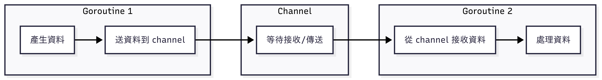

## Background
goroutine 是 Golang 非常出色的發明，但往往不了解原因就直接 go 的話，等於是為日後的開發埋下大坑。

唯有正確理解背後原理，才能夠做到正確、有效的開發！


## CSP Model

Golang 的 channel 實現 CSP (Communicating Sequential Processes) 概念，其核心思想是：

*Don't communicate by sharing memory; share memory by communicating*

意即不要讓多個 goroutine 同時存取共享的變數 (e.g., `map`, `slice`, `counter`)，改為將所有操作透過 channel 傳入特定處理的 goroutine，由它管理狀態或記憶體。



### Example

來段簡單的程式碼，說明如何使用溝通取代共享記憶體：

```go
func worker(id int, jobs <-chan int, results chan<- int) {
    for idx := range jobs {
        fmt.Printf("worker %d processes job %d\n", id, idx)
        results <- idx * 2 
    }
}

func main() {
    numWorker := 10
    numJob := 100
    jobs := make(chan int, numJob)
    results := make(chan int, numJob)

    for i := range numWorker {
        go worker(i, jobs, results)
    }

    for j := range numJob {
        jobs <- j
    }
    clsoe(jobs)

    for range numJob {
        fmt.Println(<- results)
    }
}
```

總結以上程式碼，
- 不同於傳統使用 lock (e.g., `sync.Mutex`) + 共享變數
- 透過 channel (i.e, `jobs`, `results`) 傳遞資料
- 每個 `worker` goroutine 不會存取外部變數 (e.g, global variable)

## `hchan`

回到原始碼，`hchan` 是 channel 的核心資料結構。

```go
//  go/src/runtime/chan.go

type hchan struct {
	qcount 		uint 			// total data in the queue
	dataqsiz 	uint 		    // size of the circular queue 
	buf       	unsafe.Pointer	// points to an array of dataqsiz elements
	elesize   	uint 16
	closed    	uint32 
	timer     	*timer 			// timer feeding this chan
	elemtype 	*_type 			// element type
	sendx     	uint 			// send index 
	recvx    	uint 			// receive index 
	recvq    	waitq 			// list of recv waiters 
	sendq    	waitq 			// list of send waiters
	bubble   	*synctestBubble
	
	// lock protects all fields in hchan, as well as several
	// fields in sudogs blocked on this channel.
	//
	// Do not change another G's status while holding this lock 
	// (in particular, do not ready a G), as this can deadlock 
	// with stak shriking.
	lock 		mutex
}
```

- `buf`: 只有 buffered channel 才有
- `sendx`, `recvx`: 表示傳送跟接收的索引值
- `recvq`, `sendq`: 代表等待接收和等待送出的 goroutine 佇列，所使用的資料結構 `waitq` 是一個雙向佇列 (Double-ended queue)
- `lock`: 用來保證 channel 的操作是原子性 (Atomicity)

### `waitq`

```go 
type waitq struct {
	first *sudog 
	last  *sudog
}
```

發現 `waitq` 其實是裝了兩個 `sudog`，所以接下來我們來看 `sudog`。

## `sudog`

`sudog` 的命名來源是 pseudo-g，意即它不是 goroutine 的本體，而是某個 goroutine 在同步過程中的暫存狀態。舉例來說，當一個 goroutine 因為 `ch <- v` 而阻塞，它就會被包裝成一個 `sudog` 放進 `sendq`。另外，採用 `sudog` 而非 `g` 避免 `g` 本身結構龐大的開銷。

每個 goroutine 可以同時在多個 `waitq` 上，而一個 channel 也可以有多個 `sudog` 等待，所以它們是一個 many-to-many 的關係。

`sudog` 可能在 heap 或 pool 中被來回配置和釋放，但只要它還在某個 channel 的 waitq 中，就會被 `hchan.lock` 保護，不會被 GC 提前收走。

```go
// go/src/runtime/runtime2.go 

// sudog (pseudo-g) represents a g in a wait list, such as for sending/receiving 
// on a channel.
// 
// sudog is necessary because the g <-> synchronization object relation
// is many-to-many. A g can be on many wait lists, so there may be
// many sudogs for one g; and many gs many be waiting on the same 
// synchronization object, so there may be many sudogs for one object.
//
// sudogs are allocated from a special pool. Use acquireSudog and 
// releaseSudog to allocate and free them.
type sudog struct {
	// The following fields are protected by the hchan.lock of the 
	// channel this sudog is blocking on. shrinkstack depends on 
	// this for sudogs involved in channel ops.
	
	g 			*g 
	
	next 		*sudog 
	prev 		*sudog 
	elem 		unsafe.Pointer // data element (may point to stack)
	
	// The following fields are never accessed concurrently
	// For channels, waitlink is only accessed by g.
	// For semaphores, all fields (including the ones above)
	// are only accessed when holding a semaRoot lock.
	
	acquiretime int64 
	releasetime int64 
	ticket 		uint32 
	
	//  isSelect indicates g is participating in a select, so 
	// g.selectDone must be CAS'd to win the wake-up race.
	isSelect 	bool 
	
	// success indicates whether communication over channel c 
	// succeeded. It is true if the goroutine was awoken becuase a 
	// value was delivered over channel c, and false if awoken 
	// because c was closed. 
	success		 bool 
	
	// waiters is a count of semaRoot waiting list other than head of list,
	// clamped to a uint16 to fit in unused space.
	// Only meaningful at the head of the list.
	// (If we wanted to be overly clever, we could store a high 16 bits
	// in the second try in the list.)
	waiters 	uint16 
	
	parent 		*sudog // semaRoot binary tree 
	waitlink 	*sudog // g.waiting list or semaRoot 
	waittail 	*sudog // semaRoot 
	c 			*hchan // channel 
}
```

- `isSelect`: 表示這個 goroutine 是否參與 `select`

:::note

在 `select` 語法中，可能有多個 channel 同時準備好，這時候就需要 CAS (Compare-And-Swap) 來保證只有一個 goroutine 被喚醒並執行。

當兩個 goroutine 同時抵達，則會隨機喚醒一個：

```go
ch1 := make(chan int)
ch2 := make(chan int)

go func() {
	ch1 <- 1
}()
go func() {
	ch2 <- 2
}()

select {
case v1 := <-ch1
	fmt.Println("ch1:", v1)
case v2 := <- ch2
	fmt.Println("ch2:", v2)
}
```

CAS 發生在 `g.selectDone`，誰先設置成功，就獲得被喚醒的權利。

:::

- `waiters`: 表示在 `semaRoot` 二元樹中的等待數量 (不含 root)
- `c`: 指向這個 `sudog` 所屬的 `hchan`，綁定到 channel 的 `sendq` 或 `recvq` 上