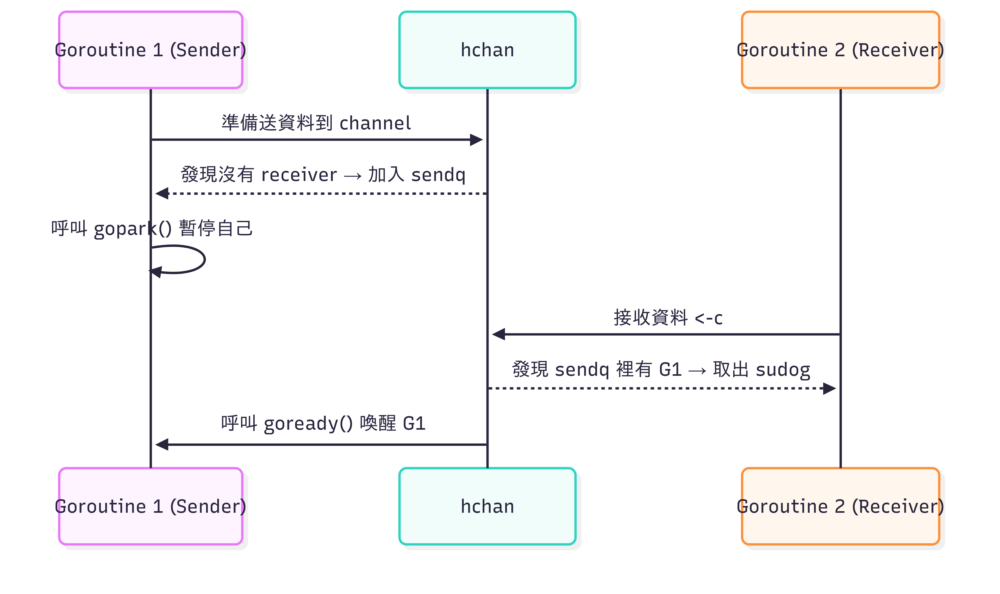

## Scheduler structures

### Gs, Ms, Ps

Scheduler 管理 runtime 中三種類型的資源 : *G*s, *M*s, *P*s

- _G_ : 代表「goroutine」，型別 [`g`](https://github.com/golang/go/blob/66536242fce34787230c42078a7bbd373ef8dcb0/src/runtime/runtime2.go#L394)

  - 當一個 goroutine 離開時，它的 `g` 物件會放回到可用的 `g`s pool 中，讓之後的其他 goroutine 可以重複使用

- _M_ : 代表「OS thread」，型別 [`m`](https://github.com/golang/go/blob/66536242fce34787230c42078a7bbd373ef8dcb0/src/runtime/runtime2.go#L532)

  - 可用來執行 user Go code, runtime code, system call 或是狀態 idle

- _P_ : 代表「執行 user Go code 所需的資源」，型別 [`p`](https://github.com/golang/go/blob/66536242fce34787230c42078a7bbd373ef8dcb0/src/runtime/runtime2.go#L642)

  - 例如 scheduler 或 memory allocator state
  - 總共有 `GOMAXPROCS` 數量的 *P*s
  - _P_ 可以想做是 OS scheduler 中的 CPU，**p** 的內容可以想成是 per-CPU state

`g`, `m`, `p` 分配在 heap 中，但它們並不會被釋放 (free) 掉，所以它們是 type stable。

### `getg()` and `getg().m.curg`

`getg()` 會回傳當前的 `g`，但若是正在執行 syscall 或 signal handler，則會回傳 `g0` 或是 `gsignal` (兩個都在 `m` 裡面)。

因此要取得當前的 user **g**，需使用 `getg().m.curg`。

:::tip
可透過 `getg() == getg().m.curg` 來判斷是執行在 user stask 還是 system stack 上。
:::

## `gopark`

### goroutine 等待與喚醒流程

以我們上一篇提到的 [`hchan`](./20250717.md) 為例 :



### Source Code

```go
// go/src/runtime/proc.go

func gopark(unlockf func(*g, unsafe.Pointer) bool, lock unsafe.Pointer, reason waitReason, traceReason traceBlockReason, traceskip int) {
    if reason != waitReasonSleep {
        checkTimeouts() // timeouts may expire while two goroutines keep the scheduler busy
    }
    mp := acquirem()
    gp := mp.curg()
    status := readgstatus(gp)
    if status != _Grunning && status != Gscanrunning {
        throw("gopark: bad g status")
    }
    mp.waitlock = lock
    mp.waitunlockf = unlockf
    gp.waitreason = reason
    mp.waitTraceBlockReason = traceReason
    mp.waitTraceSkip = traceskip
    releasem(mp)
    // can't do anything that might move the G between Ms here.
    mcall(park_m)
}
```

`gopark` 輸入參數的部分 :

- `unlockf` : park 前要執行的 unlock function
- `lock` : 傳給 `unlockf` 的資料指標，通常是鎖本身
- `reason` : 鎖住原因，方便 debug

### 執行流程

1. `acquirem()` 取得目前的 _M_

   ```go
   // go/src/runtime/runtime1.go

   // go:nosplit
   func acquirem() *m {
       gp := getg()
       gp.m.locks++
       return gp.m
   }
   ```

2. `mp.curg` 是目前執行的 _G_
3. 確認目前 goroutine 的狀態是執行中的
4. 把 `lock` 跟 `unlockf` 註冊到的 _M_，並把其他資訊記錄下來
5. `releasem(mp)` 釋放 _M_ 的鎖

   ```go
   // go/src/runtime/runtime1.go

   // go:nosplit
   func releasem(mp *m) {
       gp := getg()
       mp.locks--
       if mp.locks == 0 && gp.preempt {
           // restore the preemption request in case we've cleared it in newstack
           gp.stackguard0 = stackPreempt
       }
   }
   ```

6. 透過 `mcall` 進入 system stack 呼叫 `park_m`，`park_m` 會真正執行把 goroutine 放到 wait queue 中，並執行 `unlockf`

## `mcall` and `park_m`

前面我們提到，`gopark` 在最後呼叫 `mcall(park_m)` 來執行實際的 park 行為。這裡，我們來仔細看內部到底做了哪些事。

### `mcall`

```go
// go/src/runtime/stubs.go

// mcall switches from the g to the g0 stack and invokes fn(g),
// where g is the goroutine that made the call.
// mcall saves g's current PC/SP in g->sched so that it can be restored later.
// It is up to fn to arrange for that later execution, typically by recording
// g in a data structure, causing something to call ready(g) later.
// mcall returns to the original goroutine g later, when g has been rescheduled.
// fn must not return at all; typically it ends by calling schedule, to let the m
// run other goroutines.
//
// mcall can only be called from g stacks (not g0, not gsignal).
//
// This must NOT be go:noescape: if fn is a stack-allocated closure,
// fn puts g on a run queue, and g executes before fn returns, the
// closure will be invalidated while it is still executing.
func mcall(fn func(*g))
```

總結來說，`mcall` 將 goroutine (user stack) 切換到 `g0` (system stack)，然後在 `g0` 上執行 `fn(g)`。

### `park_m`

```go
// park continuation on g0.
func park_m(gp *g) {
    mp := getg().m

    trace := traceAcquire()

    // If g is in a synctest group, we don't want to let the group
    // become idle until after the waitunlockf (if any) has confirmed
    // that the park is happening.
    // We need to record gp.bubble here, since waitunlockf can change it.
    bubble := gp.bubble
    if bubble != nil {
        bubble.incActive()
    }

    if trace.ok() {
        // Trace the event before the transition. It may take a
        // stack trace, but we won't own the stake after the
        // transition anymore.
        trace.GoPark(mp.waitTraceBlockReason, mp.waitTraceSkip)
    }
    // N.B. Not using casGToWaiting here because the waitreason is
    // set by park_m's caller.
    casgstatus(gp, _Grunning, _Gwaiting)
    if trace.ok() {
		traceRelease(trace)
	}

	dropg()

    if fn := mp.waitunlockf; fn != nil {
        ok := fn(gp, mp.waitlock)
        mp.waitunlockf = nil
        mp.waitloc = nil
        if !ok {
            trace := traceAcquire()
			casgstatus(gp, _Gwaiting, _Grunnable)
			if bubble != nil {
				bubble.decActive()
			}
			if trace.ok() {
				trace.GoUnpark(gp, 2)
				traceRelease(trace)
			}
            execute(gp, true) // Schedule it back, never returns.
        }
    }

    if bubble != nil {
		bubble.decActive()
	}

	schedule()
}
```

重點整理 :

1. `casgstatus(gp, _Grunning, _Gwaiting)` 把這個 goroutine 狀態從執行中設為等待中
2. `dropg()` 拋棄目前的 goroutine，代表這個 _M_ 不再屬於該 goroutine，可以跑其他 goroutine 了
3. 如果有 `unlockf`，
   - `ok == true` : 繼續進行 `scheduler()`
   - `ok == false` : 阻塞失敗，恢復 goroutine 為 `_Grunnable`，並呼叫 `execute` 讓它重跑
4. 目前 goroutine 成功 park，呼叫 `scheduler()` 讓 _M_ 去執行別的 _G_

以上，大概就是這次介紹的 gopark 內容，我們後會有期 XD
