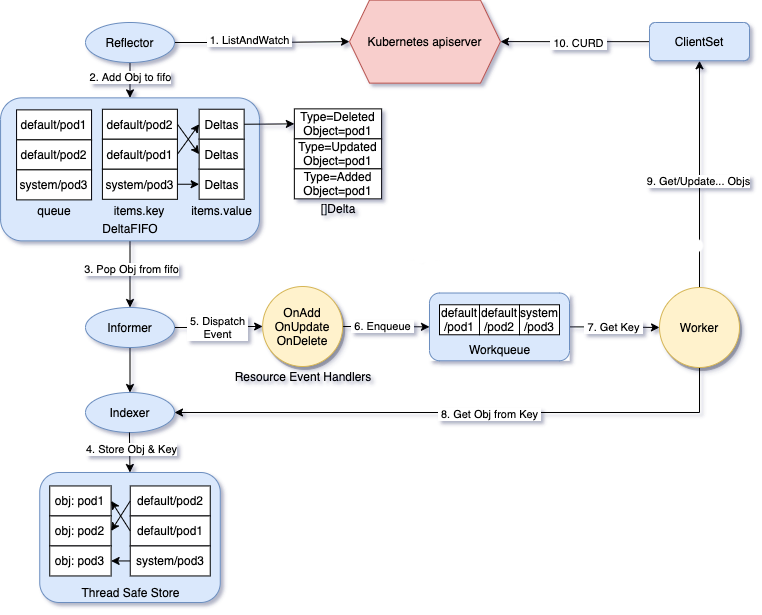

## Background 

將人生第一次講者經驗奉獻給 KCD。

大學時期，認識身邊很多年輕有為的學生在開源社群活躍，讓我開始認識這塊領域，也漸漸感受到開源的活力與熱忱。

邁出第一步往往需要決心與勇氣，很幸運也很感激地在年初 SITCON 時受到 Evan 跟 Tico 的鼓勵，並且在擔任 KCD 志工時，感受到大家的慷慨熱情與協助。

這次演講內容，主要是介紹 Kubernetes Operator 的設計理念與使用場景，以及如何用 kubebuilder 開發 Operator 和一些實踐建議。

:::important

這篇文章不會完整涵蓋演講的每個細節，如果未來有影片釋出會再補上文章。目前本文會提供簡報以及一些重點演講橋段。

簡報連結 : [From Zero to Operator Hero: Building Smarter Kubernetes with kuberbuilder](https://docs.google.com/presentation/d/1Y-9srgk90juZL_BAMs7jatYophveKA-GhOxcpU7XG5I/edit?usp=sharing)

:::

## Kubernetes Operator 介紹

Kubernetes 最初用來定義與管理資源物件，並不是用於建置狀態管理的。因此在管理有狀態應用程式，往往需要繁瑣的操作流程。Operator 透過利用 Kubernetes 內建功能（例如自我修復、協調），可以自動化任何應用程式的生命週期和操作。

以下這些都是可以套用 Operator 的情境 :
- 需要依序進行
- 要等待某些條件達成（如同步完成）
- 要處理錯誤與重試機制

Operator 會監控 (WATCH) Custom Resource 的變化事件 (CHANGE EVENTS)，根據 Custom Resource 的定義，與 Kubernetes API 交互以調整 (ADJUST STATE) 集群的實際狀態，確保與期望狀態一致。實現方式就是透過內部的 Controller 使用 **Reconciliation** loop 不斷將 desired state 與 current state 進行比較。

## kubebuilder 架構

kubebuilder 是一個可以讓你撰寫自己的 Operator 的框架。它是一個 CLI 工具，用來：
- 初始化 Operator 專案框架，讓你實作細節
- 為專案添加 API (也就是 Kind)
- 用來添加 webhook

## kubebuilder 搭建 Operator 的眉眉角角

### Webhook

對於一個 Operator 來說，雖然 mutating webhook 能夠修改物件的規範，但直接更改其狀態並[不被視為 Operator 標準做法](https://book.kubebuilder.io/reference/admission-webhook)，常常會導致意想不到的結果。

### Reconciliation

Reconcile 是一個持續的 loop，執行必要的操作來維持期望狀態。

kubebuilder 創建模板後，使用者透過實作 `controller-runtime` (封裝 `clieng-go`) 的 `Reconcile` function 實現。

### `client-go`

雖然這裡放了一張與簡報不同的圖片，但目的是希望可以呈現更完整的細節。以下這段是根據簡報中的圖片說明 : 

client-go 是一個專門用在 Kubernetes 的 Golang library，以下介紹幾個重要元件所扮演的角色：
- Reflector、Informer : Operator 利用 Reflector 和 Informer 監控 CRD 或相關資源的變化
    -  e.g, 當用戶創建一個 MyApp CRD 時，Informer 檢測到並觸發處理
- Resource Event Handlers : Operator 通過自定義 Resource Event Handlers 實現業務邏輯
    - e.g., 根據 MyApp 的 spec 字段創建相應的資源
- Workqueue 與 Process Item : Operator 的核心是調節（Reconciliation）循環，Workqueue 和 Process Item 確保狀態一致性
    - e.g., 若 MyApp 期望 3 個副本，但實際只有 2 個，Handle Object 會調用 API 創建一個新 Pod

### Secondary Resources

為什麼要監控輔助資源呢？

首先我們了解監控資源的目的，是為了確保 Kubernetes 資源保持所需狀態。在建置 Controller 時，不僅要管理 primary resource (主要資源)，還要監控 secondary resource (輔助資源)。

如果無法追蹤這些資源，可能會導致 Controller 的行為和整個叢集狀態不一致。

重點如下 : 

- 確保一致性
    - e.g., 輔助資源可能被修改或刪除，導致系統不同步
    - 監視輔助資源可以確保立即偵測到任何更改，從而允許 controller 協調並恢復所需狀態
- 避免隨機自我修復 : 
    - controller 只有在重新啟動或觸發特定事件時，才會進行自我修復
    - 如果不監控輔助資源，可能會導致問題無法預測或即時反應，監控輔助資源可確保及時解決不一致問題
- 有效的生命週期管理 : 
    - 因為輔助資源可能不是由 controller 直接擁有，但它們的狀態會影響主要資源的行為
    - 如果不監控這些資源，可能會留下孤立資源或過時的資料

## Good Practices

### Reconcile functions should be idempotent

- 不應該在 Reconciler 中針對不同類型的事件 (e.g., 建立、更新、刪除) 使用不同的邏輯
- 應該在每次執行前，先確認現有的已存在狀態
- idempotent 的意思是執行一次或多次，對系統的影響應該跟執行一次一樣

### 一個 Controller 不應該管理多個 CRDs

這個部分跟常見的軟體開發模式差不多。其中併發與同步，要注意的是當多個 custom resources 有依賴關係時，可能會導致 race condition。
