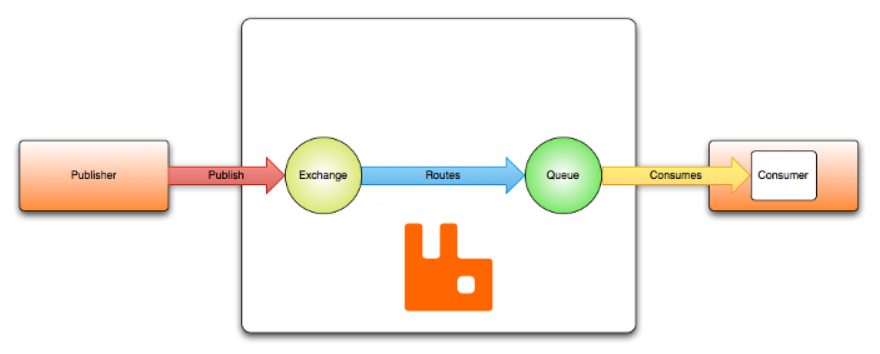
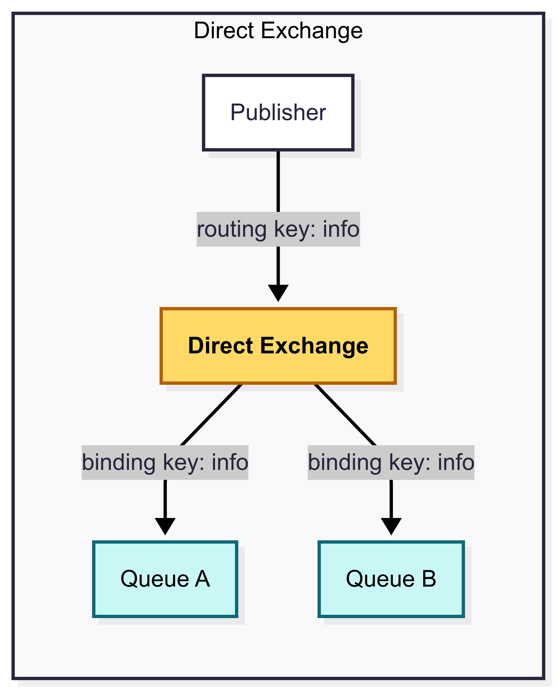
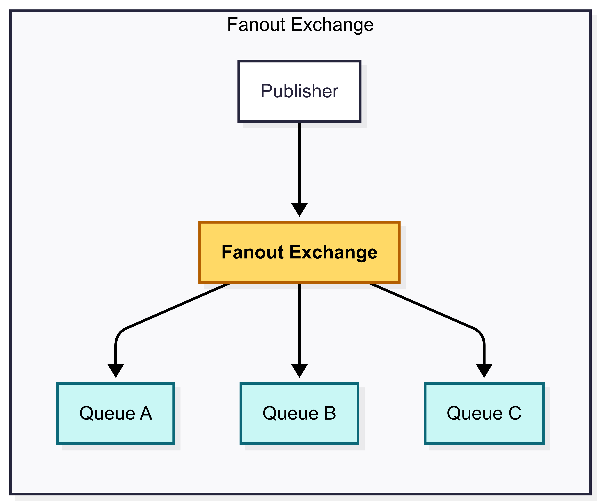
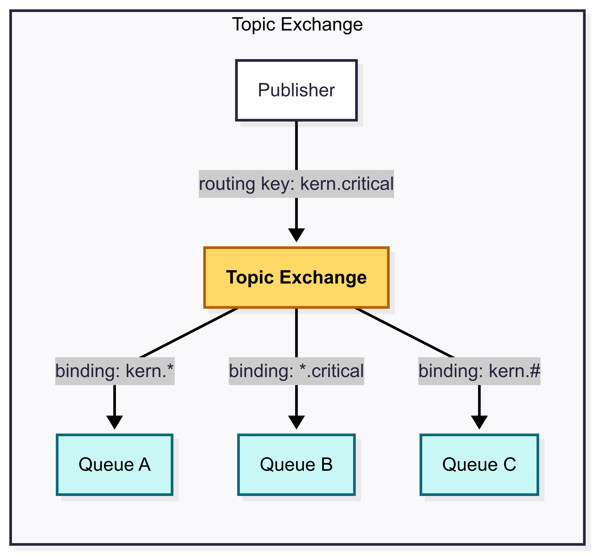
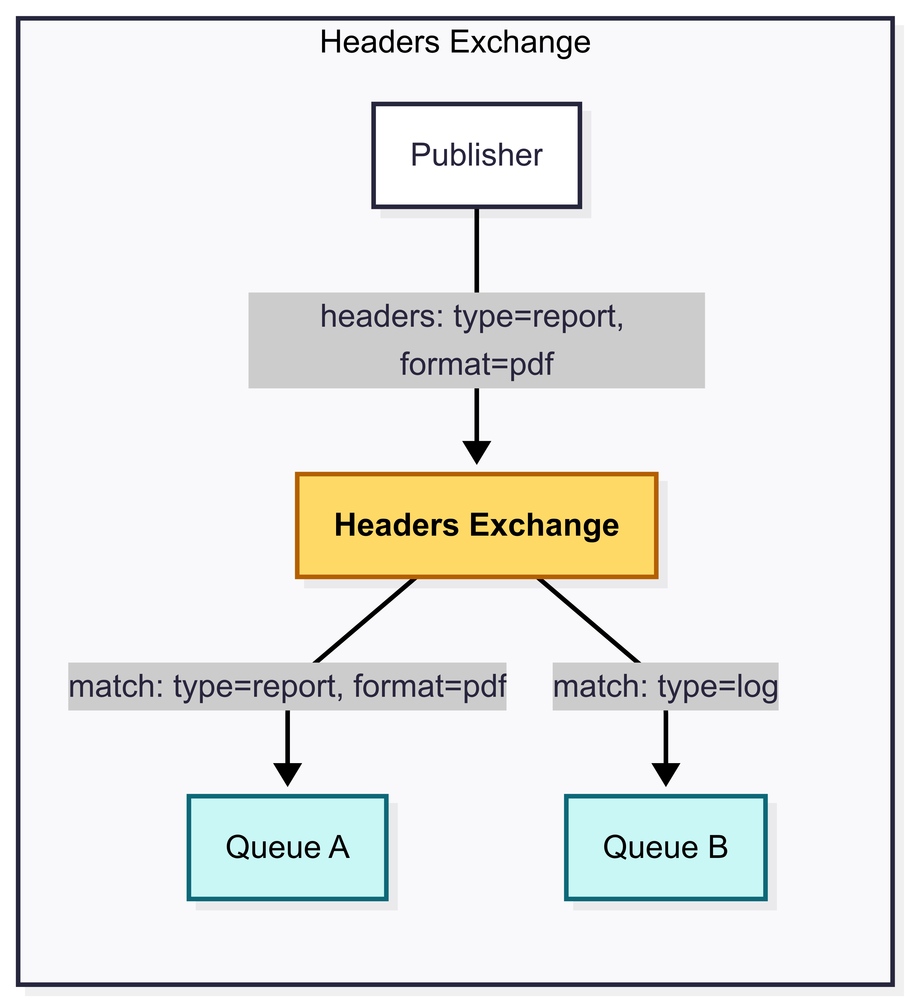

## Overview 

核心資料流概念如圖從左至右 : Publisher ➝ Exchange ➝ Queue ➝ Consumer
1. **Messages** 透過 **publishers** 傳送到 **exchange**
2. **Exchanges** 會根據 **bindings** (routing rules) 將 **messages** 路由到指定的 **queues**
3. **Consumers** 從 **queues** 中接收 **messages**，透過兩種接收方式 : 
    - **Push-based** (subscribed)
    - **Pull-based** (fetch on demand)

Exchange、Queue、Binding 這三者被稱為 *AMQP entities* ，而那個橘色兔子的區塊就是 **Broker**。

## Exchanges and Exchange Types

Exchanges 接收訊息並決定如何分發，根據 *exchange type* 與 *bindings* 會轉送到 0 或多個 queues。

AMQP 0-9-1 brokers 提供四種 exchange types : 
| Exchange type | Default pre-declared names |
| ------------- | -------------------------- |
| Direct exchange | (Empty string) and amq.direct |
| Fanout exchange | amq.fanout |
| Topic exchange | amq.topic |
| Headers exchange | amq.match (and amq.headers in RabbitMQ) |

預設的 Exchange 是一個沒有名字 (empty string) 的 direct exchange，由 broker 預先定義。並且在你命名一個 queue (e.g., search-indexing-online) 之後，broker 會用相同名稱 (i.e., search-indexing-online) 的 routing key (binding key) 綁定到 default exchange。

### Direct Exchange

- Direct exchange 根據 message routing key 傳遞 messages 到 queues
- 適用於單點傳播 (unicast) 或 多點傳播 (multicast)

1. Queue 根據 routing key *K* 綁定到 exchange 
2. 當新的 message (with routing key *R* ) 抵達 direct exchange，exchange 根據 *K* = *R* 路由到對應的 queue
3. 如果 exchange 上有多個綁定相同 routing key *K* 的 queues，則 exchange 會把 message 路由給所有符合 *K* = *R* 的 queues

### Fanout Exchange

- Fanout exchange 會傳送到所有綁定到 exchange 的 queues，忽略 routing key
- 適用於廣播 (broadcast)
- 範例用途可以參考[文件](https://www.rabbitmq.com/tutorials/amqp-concepts#exchange-fanout)

### Topic Exchange

- Topic exchanges 會根據符合 pattern 的 routing key 路由 messages 到一個或多個 queues
- 適用於 publish / subscribe 並在多點傳播 (multicast) 中經常使用
- 範例用途可以參考[文件](https://www.rabbitmq.com/tutorials/amqp-concepts#exchange-topic)

### Headers Exchange

- Headers exchange 不使用前面提到的 routing key，而是用 headers 來做比對
- 它利用 headers 達到類似 pattern 式的語法匹配，而且不限定於 string，也可以是 integer or hash (dictionary)

## Queues

Queue 儲存傳送給 Consumer 的 message。

在 AMQP 0-9-1 中，queue 可分為 durable (持續性的) or transient (暫時性的)。durable queue 的 metadata 會被存在 disk 上，而 transient queue 的 metadata 會被存在 memory 上。

## Bindings 

Binding 是定義 exchange 如何根據 routing key 將訊息導向特定 queues 的 rules (routing key 就像 filter)。如果找不到對應的 queue，message 會依據使用者設定 dropp 掉或是回傳給 publisher。

## Connections and Channels

- AMQP 0-9-1 是 long-lived TCP 連線
- AMQP 採用 [channels](https://www.rabbitmq.com/docs/channels) 設計，讓多個連線共享一個 TCP 連線
- 由於 channel 之間是互不影響的，所以它們攜帶一個 channel ID 讓 broker 與 clients 辨別