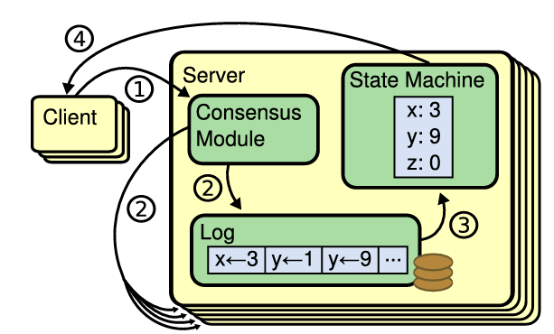
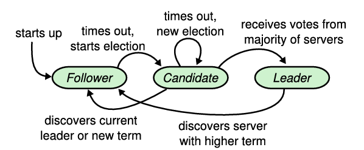
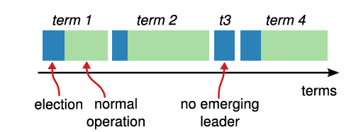

## Preface

本次介紹的 Raft 算是筆者閱讀 [*《 In Search of an Understandable Consensus Algorithm 》*](https://raft.github.io/) 論文的筆記。如果夥伴希望深入了解 Raft 概念的話，論文絕對是最詳細的好夥伴。

## Replicated State Machine

共識算法常用來處理 fault tolerance (容錯) 問題。透過在各台伺服器上執行相同的狀態機 (Replicated State Machine)，確保在某些伺服器失效時，系統仍能持續運作。

在 Replicated State Machine 架構中，每台伺服器都會儲存一份 log (日誌)，記錄系統要執行的指令。所有伺服器的 log 內容必須完全相同、順序一致，才能保證每台伺服器的狀態機 (State Machine) 在執行後達到一致的狀態與輸出結果。這是因為狀態機是確定性的 (deterministic)，只要輸入的指令序列一樣，就會產生一樣的結果。

確保 log 一致性的核心關鍵在於「Consensus Module（共識模組）」，常見實作 e.g., Raft, Paxos。

## The Raft Consensus Algorithm

Raft 核心設計採用 Leader-based 的方式，選舉出一位 leader 管理複製 log 流程 : 
1. Leader 負責處理 client 請求，將請求作為 log entries 加入自己的 log 中
2. 接著，leader 將 log entries 複製 (replicate) 到其他 followers
3. 當 log 被大多數 followers 確認過後，leader 會通知大家把 log entries 應用到狀態機

如果 leader 失效或其他節點段開，則會進行新的 leader election。

Raft 將共識問題拆分成三大問題 : 
- **Leader Election (領導者選舉)** : 當原本的 leader 失效時，系統需快速選出新的 leader
- **Log Replication (日誌複製)** : Leader 將 client 的 log entries 複製 (replicate) 到其他伺服器，使整個 cluster 的 log 保持一致
- **State Machine Safety (狀態機安全性)** : 若某伺服器已將某個 log entries 應用到其狀態機，則其他伺服器在相同的 log index 上不能套用不同的指令 (command)

與五大準則 :
- **Election Safety** : 一個 term 最多只有一個 leader 被選出
- **Leader Append-Only** : Leader 不能 overwrite 或刪除自己的 log entries，只能夠添加新的
- **Log Matching** : 如果兩個 logs 的某個 entry 具有相同的 index 和 term，那 logs 在給定 index 以前的所有 entries 都相同
- **Leader Completeness** : 如果一個 log entry 在某個 term 被 committed (提交)，那未來所有 leader 都會擁有這筆 log entry
- **State Machine Safety** : 若已經有伺服器已經把特定 index 的 entry 套用到狀態機，那就不會有其他狀態機在相同 index 套用不同 command

### The Raft Basis

Raft cluster 中常見的伺服器配置數量是 5 台，最多可容忍 2 台故障。

每個伺服器在任何時間會處於以下三種狀態之一 : 
- Leader (領導者)
    - 負責處理所有 client 請求
    - 若 client 請求發送到 follower，follower 將其重導向到 leader
- Follower (追隨者)
    - 被動回應來自 leader 與 candidate 的請求
    - 不主動發送任何請求
- Candidate (候選者)
    - 當系統需要選舉新的領導者時，伺服器會轉為 candidate
    - 發起投票以競選成為新的 leader

論文中三種 `State` 的參數定義 : 

1. Persistent state on all servers
- `currentTerm` : latest term server has seen
- `votedFor` : candidatedId that received vote in current term
- `log[]` : log entries; each entry contains command for state machine, and term when entry was received by leader

2. Volatile state on all servers
- `commitIndex` : index of highest log entry known to be committed
- `lastApplied` : index of highest log entry applied to state machine

3. Volatile state on leaders (reinitialized after election)
- `nextIndex[]` : for each server, index of the next log entry to send to that server
- `matchIndex[]` : for each server, index of highest log entry known to be replicated on server

#### Term 與選舉機制

Term (任期) 是一個單項遞增的整數編號，用作為 Raft 內的邏輯時鐘 (logical clock)，用來辨別過時資訊。

每個 term 開始時會觸發一次選舉 (election)，此時一個或多個節點會成為 candidate 嘗試競選 leader。
- 若成功獲得多票數，則該 candidate 成為該 term 的 leader
- 若平手 (split vote)，則該 term 沒有 leader，系統會直接啟動下一個 term 並重新選舉

在實作上要注意，每個伺服器都會記錄自己的 `currentTerm`，確保該值只增不減。當伺服器相互通信時，交換各自的 `currentTerm`，若發現對方的 `currentTerm` 較新，則**更新自己的 `currentTerm` 並退回 follower 狀態** ; 反之若收到過期的 `currentTerm` 請求，則可拒絕該請求。

#### 通訊方式 (RPC)

Raft 透過 RPC (Remote Procedure Call) 進行伺服器間的通訊，主要有三種 RPC : 
1. `RequestVoteRPC` : 由 candidate 發送，請求其他節點投票
2. `AppendEntriesPRC` : 由 leader 發送，傳送新的 log entry 與 heartbeat
3. `InstallSnapshotRPC` : 傳送快照資料

