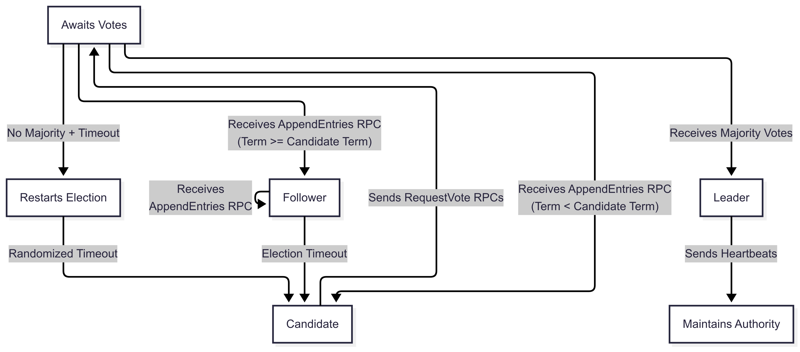
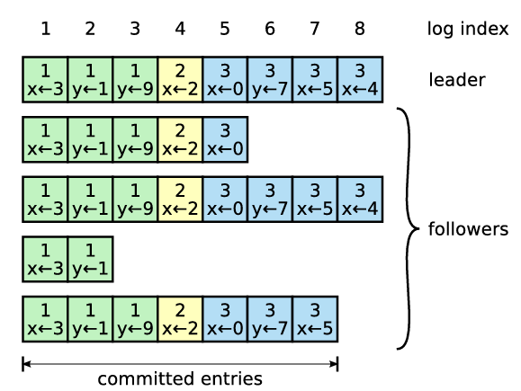
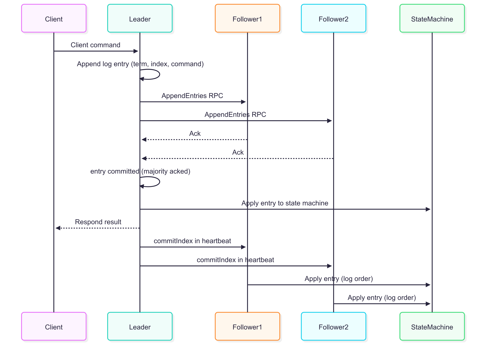
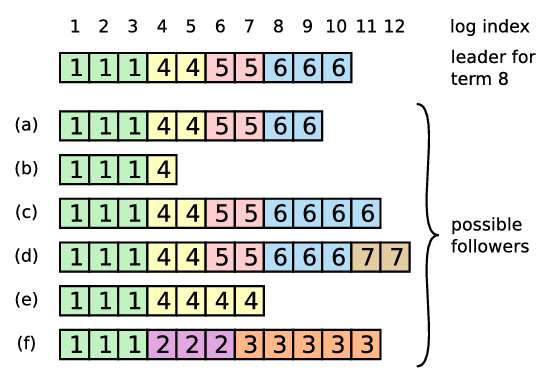
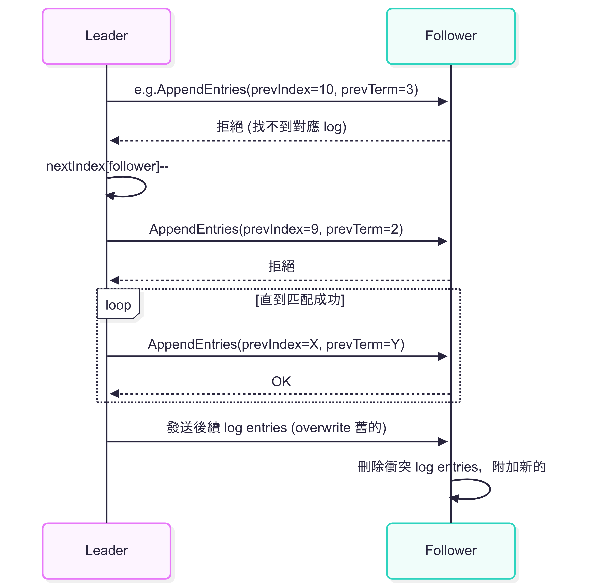

## Preface

本次介紹的 Raft 算是筆者閱讀 [_《 In Search of an Understandable Consensus Algorithm 》_](https://raft.github.io/) 論文的筆記。如果夥伴希望深入了解 Raft 概念的話，論文絕對是最詳細的好夥伴。

## Leader Election

Raft 透過 heartbeat 與 randomized election timeout 來維持系統穩定與避免選舉衝突。

所有伺服器啟動時都是以 follower 身分開始，只要 follower 有持續收到來自 leader 或 candidate 的有效 `AppendEntries` RPC，就會維持在 follower 狀態。

Leader 會定期發送 `AppendEntries` RPC (no log entries) 最為 heartbeat 訊號，告訴 followers 它還存在並有效。若 follower 在一定時間內未收到任何 RPC (election timout)，則假設 leader 失效並啟動選舉流程。此時，follower 會把自己升級為 candidate 並投票給自己 (`currentTerm` + 1)，然後平行發送 `RequestVote` RPC 給 cluster 內其他所有伺服器。

接下來可能發生以下幾種情況 :

1. Candidate 獲得大多數節點的選票 (過半票)
   - 成為 Leader 並立即發送 Heartbeat 取得領導權 + 防止新選舉
   - 每個伺服器同個 term 內只能投給一個 candidate (first-come-first-served)
   - 遵守 Election Safety Property，一個 term 只會有一個 leader
2. 在等待投票期間，Candidate 收到其他伺服器的 `AppendEntries` RPC (宣稱是 Leader)
   - 若 `incoming_term >= currentTerm`，則承認該 leader 並回到 follower 狀態
   - 若 `incoming_term < currentTerm`，則拒絕 RPC 請求，繼續競選
3. 無人獲選 (票數分裂，無人過半)
   - 這種情況下，每個 candidate 都會 election timeout，重新啟動新一輪選舉

為了解決票數分裂的問題，Raft 採用 Randomized Election Timeout :

- 每個伺服器的 election timeout 隨機取自固定區間 150 ~ 300ms
- 導致某一伺服器較早 timeout 後發起選舉並當選

:::note
`AppendEntries` RPC 在論文中定義的參數規格 :

**Arguments**

- `term` : leader’sterm
- `leaderId` : so follower can redirect clients
- `prevLogIndex` : index of log entry immediately preceding new ones
- `prevLogTerm` : term of prevLogIndex entry
- `entries[]` : log entries to store (empty for heartbeat)
- `leaderCommit` : leader's commitIndex

**Results**

- `term` : currentTerm
- `success` : true if follower contained entry matching prevLogIndex and prevLogTerm

:::

## Log Replication

Logs 組成如下圖，state machine 中的 log entry 會包含 term 和 command :

### Apply Log

以下是從 client 發送 request 到最後 state machine 套用指令的流程圖 :

#### Leader 處理邏輯

1. Leader 接收到 client request 之後，添加該 log entry 到自己的 log (包含 command, term)
2. 向所有 follower 並行發送 `AppendEntries` RPC，當多數節點成功複製後，此 entry 轉為 `committed` 狀態
3. 此時，leader 就可以將該 entry apply 到自身的 state machine，並回應 client 結果
4. Leader 在後續的 RPC 中，會攜帶 `commitIndex`，通知 follower 同步 apply

#### Follower 處理邏輯

1. 收到 `AppendEntries` 後，若是 `prevLogIndex == prevLogTerm`，就接收新 entries
2. 若 `commitIndex` > 當前 `commitIndex`，則 apply 對應的已複製 entries

### Restore Log

當 Leader crash 可能會造成 log 不一致的情境，如下圖 :

- Follower 缺失 entries (沒收到)
- Follower 有多 entries (舊的 leader 未被 commit 的部分)
- 兩者都有

`AppendEntries` 的 consistency check 流程 :

1. Leader 傳送 `AppendEntries(term, prevLogIndex, prevLogTerm, entries...)`
2. Follower 檢查 `prevLogIndex` 是否存在且 `term` 一樣
   - 如果一樣，回傳 true 並接受新 entries
   - 否則回傳 false，leader 會減少 `nextIndex` 並重試

確保只有之前的 log 完全一致時，才允許新增 log。
