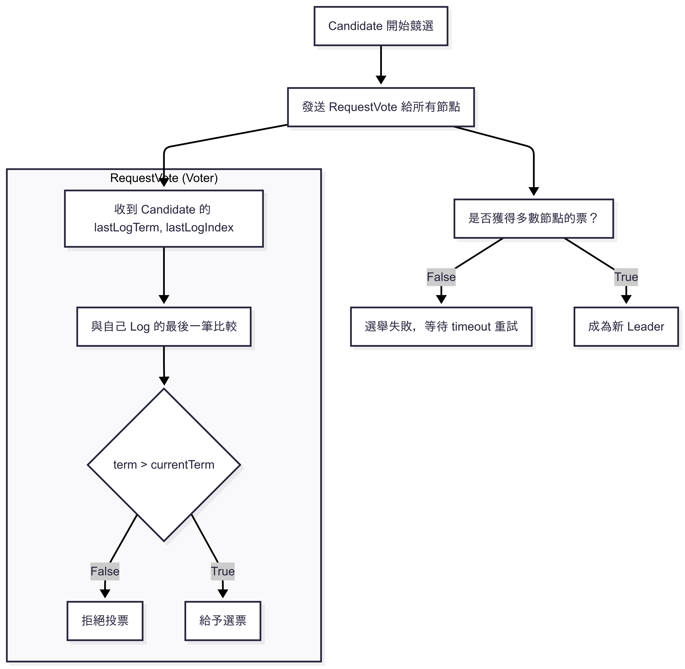
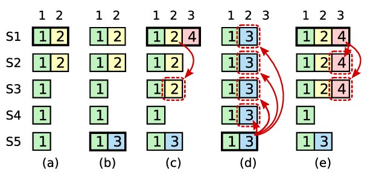

## Preface

本次介紹的 Raft 算是筆者閱讀 [_《 In Search of an Understandable Consensus Algorithm 》_](https://raft.github.io/) 論文的筆記。如果夥伴希望深入了解 Raft 概念的話，論文絕對是最詳細的好夥伴。

## Election Restriction

由於 Raft 不會在 leader 選出後才去補遺失的 committed entries，所以在選舉前，candidate 就必須要擁有所有的 committed entries 才能被選為 leader。

Candidate 發送 `RequestVote` RPC 聯絡多數節點，邏輯如下 :

## Committing Entries From Previous Terms

- Previous term 的 entry 即便被寫入多數節點，也不會被判定為 committed
- 只有**當前 term 的 entry 被寫入多數節點**才算是 commiitted
- 一旦這筆 entry 被判定為 commit 狀態，那它之前的**所有 entries** 都會被視為 committed
- 因此 previous term 的 entry 只有當它「在新 leader 的 log 中 + 新的 entry 成功 commit」，才會是 committed

- **(a) S1 是 term 2 的 leader，寫入 entry 2**
  - 指複製到 S2，尚未達成 commit
- **(b) S1 crash，S5 成為 term 3 的 leader**
  - S5 透過 S3, S4 的選票成為 term 3 的 leader
  - S5 在自己的 index 2 上寫入 term 3 的 entry
- **(c) S5 crash，S1 重啟並再次成為 leader**
  - S1 繼續複製舊的 term 2 entry
  - 此時 term 2 entry 已經存在多數節點上，但尚未 commit (因為 term 2 不是當前的 term，所以需要當前 term 4 entry 被寫到多數節點上，term 2 entry 才能算是 committed)

錯誤做法 :

- **(d) S1 再次 crash，S5 再次當 leader**
  - S5 把自己在 index 2 的 term 3 entry 複製到所有節點上，覆蓋其他節點的 index 2

正確做法 :

- **(e) S1 在 crash 前，複製 term 4 entry 到多數節點上**
  - 這筆 entry 可被視為 committed
  - 根據 Log Matching Property，先前所有 entry 也都成為 committed
  - 此時 S5 將無法在 term 5 贏得選舉，因為其他節點看到更新的 log 和 term

## Follower and Candidate Crashes

相對於處理 leader crash 的狀況，Raft 對 follower 和 candidate crash 的處理邏輯簡單明瞭。

Raft 採取 idempotent 的設計 (不管執行幾次，產生的結果都一樣，同樣概念運用在 k8s operator reconcile)，重新發送相同的 `AppendEntries` 或 `RequestVote`。
