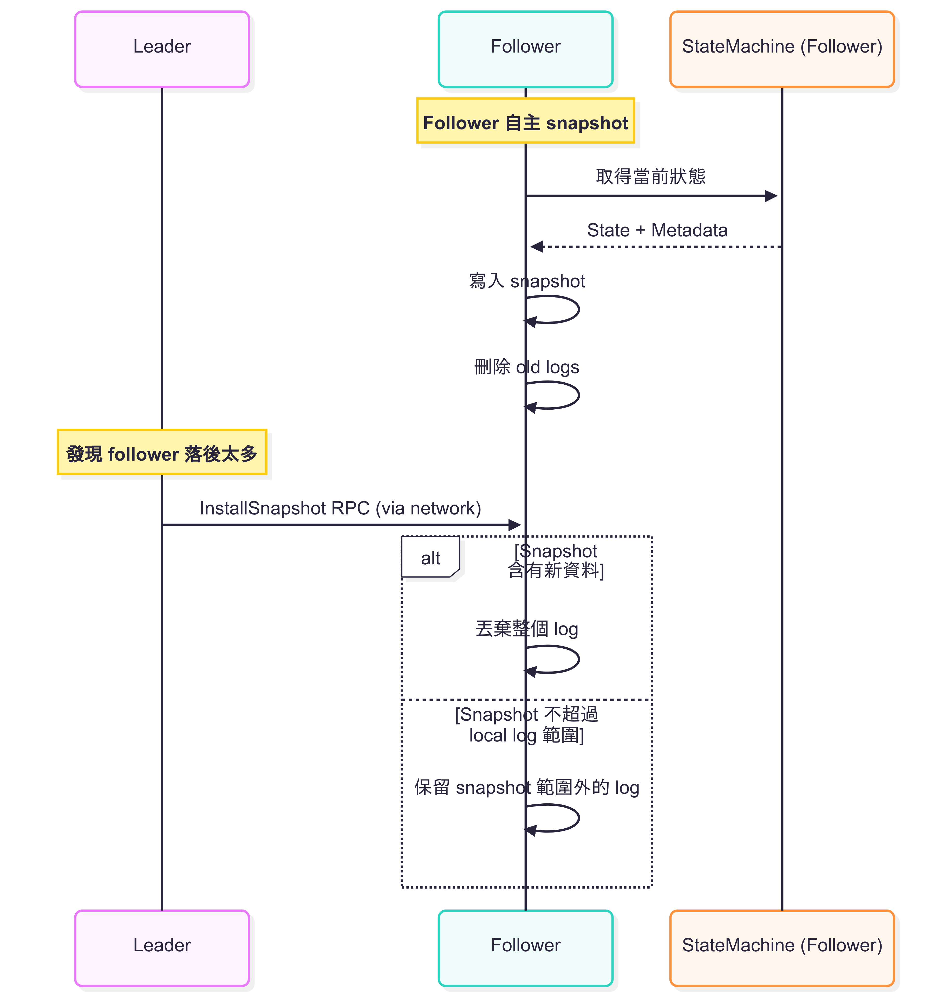

## Preface

本次介紹的 Raft 算是筆者閱讀 [_《 In Search of an Understandable Consensus Algorithm 》_](https://raft.github.io/) 論文的筆記。如果夥伴希望深入了解 Raft 概念的話，論文絕對是最詳細的好夥伴。

## Snapshot 

Log 會隨著 client request 不斷增長，因而造成大量儲存空間與系統恢復耗時增加。

所以 Raft 使用 Snapshot 方式，將整個目前系統狀態寫入 snapshot，並丟棄已經 commit 的 log entries。

## `InstallSnapshot`

某些情況下 (e.g., follower 長時間 offline)，leader 已經刪除 log entries，但 follower 還沒收到，導致 leader 無法用 `AppendEntries` 補齊。這時 leader 會調用 `InstallSnapshot` RPC 將最新的 snapshot 傳給落後的 follower。

:::note

`InstallSnapshot` 參數 : 

**Arguments**

- `term` : leader's term
- `leaderId` : follower can redirect client
- `lastIncludedIndex` : the snapshot replaces all entries up through and including this index
- `lastIncludedTerm` : term of lastIncludedIndex
- `offset` : byte offset where chunk is positioned in the snapshot file
- `data[]` : raw bytes of the snapshot chunk, starting at offset
- `done` : true if this is the last chunk

**Results**

- `term` : currentTerm, for leader to update itself

比較重要的是 `lastIncludedIndex` 和 `lastIncludedTerm`，幫助後續 log 的 `AppendEntries` 做一致性檢查。

:::

而 follower 收到 snapshot 後，有兩種情況 : 
1. Snapshot 含有新資訊 (超過 local log) : 丟掉原本的 log (避免 uncommitted conflict)，套用 snapshot
2. Snapshot 的資料涵蓋在 local log 中 : 刪除被 snapshot 範圍覆蓋的 log，後面的 entries 繼續保留

## Follower Local Snapshot

Snapshot 其實屬於本地的狀態管理，不涉及共識，因此 Raft 允許 follower 自身進行 snapshot。 (只有當 follower 落後 leader 太多，leader 才會調用 `InstallSnapshot` 進行同步，資料仍然由 leader 傳出)

前面提到的流程如下 : 

