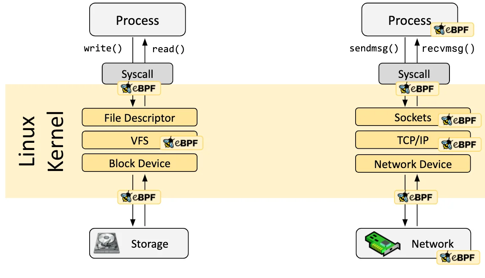
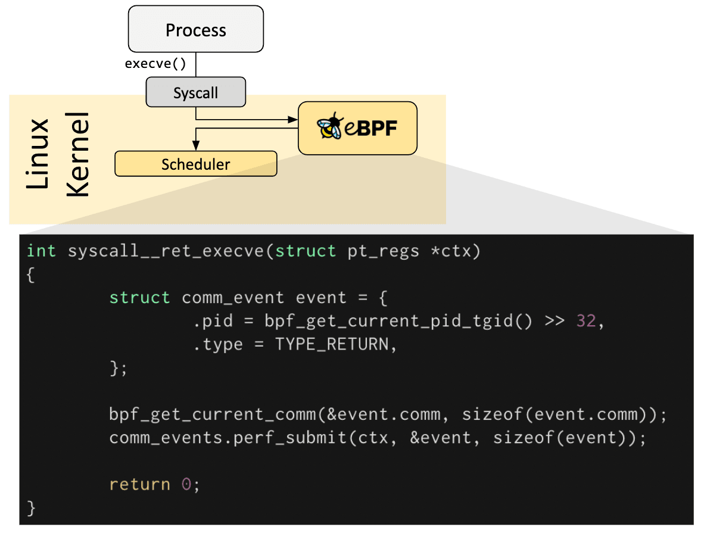
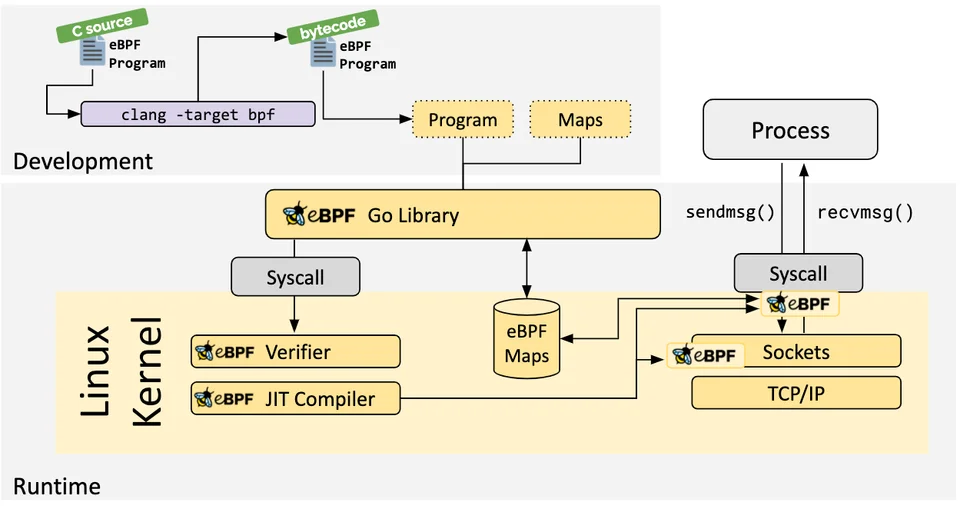
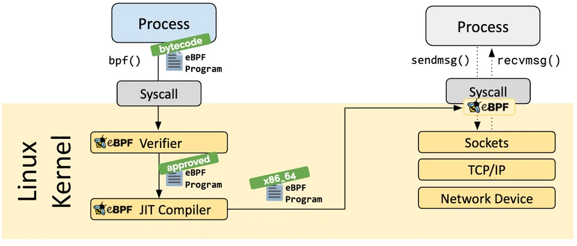

## What is eBPF?

eBPF (extended Berkeley Packet Filter) is revolutionizing how we interact with the Linux kernel, without needing to modify it or reboot.

### Features of eBPF



- **Dynamic Behavior at Runtime**
  eBPF lets you safely run custom programs inside the Linux kernel without modifying kernel code.
- **Safe and Efficient**
  Programs are verified for safety and compiled with a JIT compiler, running almost as fast as native code.
- **Versatile Use Cases**
  From networking to security and observability, eBPF unlocks deep kernel-level insights and control.

### Real-world Examples

- High-performance networking and load balancing
- Security observability with minimal overhead
- Application and container runtime enforcement
- Performance tracing and profiling

## Hook

- eBPF programs are **event-driven** (they run when something specific happens)
- These trigger points are called **hooks**, e.g., system calls, kernel function entry/exit, network events, tracepoints, etc.
- If a hook doesn't exist ? then use :
  - kprobes (for kernel)
  - uprobes (for user-space)

### Overview



1. A **user-space** process calls `execve()` to launch another program.
2. This triggers a **syscall** into the Linux kernel.
3. eBPF program attaches a custom program at this hook point to capture data.

#### Code

```c=
int syscall__ret_execve(struct pt_regs *ctx)
```

The eBPF program that runs when `execve()` syscall returns.

1. Create an event struct to collect data

```c=
struct comm_event event = {
  .pid = bpf_get_current_pid_tgid() >> 32,
  .type = TYPE_RETURN,
};
```

- `bpf_get_current_pid_tgid()` returns the current process ID (PID) and thread ID (TID) combined
- `>> 32` is a bit shift operator that extracting the PID
- `TYPE_RETURN` indicates this was the syscall return point

2. Capture the command name of the process

```c=
bpf_get_current_comm(&event.comm, sizeof(event.comm));
```

3. Submit the event to user space

```c=
comm_events.perf_submit(ctx, &event, sizeof(event));
```

Common Practice is to use compilers like LLVM to convert pseudo-C code into eBPF bytecode.

## Loader & Verfication Architecture



### Process (User-space)

- A user-space process calls a function `bpf()`, which loads eBPF bytecode into the kernel via a system call.

### Linux Kernel



- eBPF Verifier
  The kernel's eBPF verifier analyzes the bytecode to ensure safety, checking for invalid memory access, infinite loops, etc. If approved, the program proceeds.
- x86_64 eBPF Program
  The diagram indicates the program is compiled for the x86_64 architecture.
- eBPF JIT Compiler
  The Just-In-Time compiler translates the verified eBPF bytecode into native machine code for efficient execution on the target architecture.

### Process (Runtime Interaction)

- A seperate process performs network operations using `sendmsg()` and `recvmsg()` system calls, which interact with the kernel's socket layer.
- An eBPF program is attached to these system calls, allowing it to monitor or modify the network traffic.
