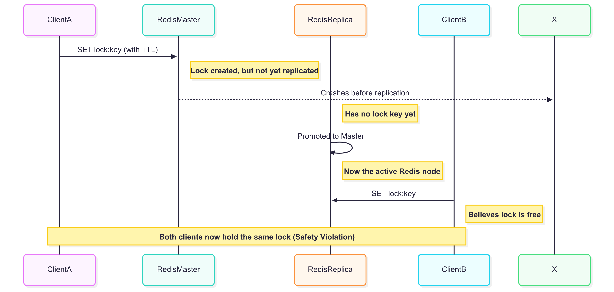

## Safety and Liveness Guarantees

To build a reliable distributed locksing system, Redis ensure three essential properties :

1. **Safety : Mutual Exclusive**

   At any given time, **only one client can hold the lock** for a particular resource.

2. **Liveness A : A Deedlock-Free**

   If a client crashes or gets partitioned from the network, the system must **eventually release the lock**, so others can acquire it.

3. **Liveness B : Fault Tolerance**

   As long as a **majority of Redis nodes are available**, clients should still be able to **acquire and release locks**.

:::important

**Traditional Failover**

Many Redis-based lock libraries rely on a **single Redis instance**, possibly backed by a **replica** for failover.

The race condition can be illustrated with the following diagram :

:::

## What is Redlock ?

Redlock is a distributed locking algorithm designed to work with multiple independent Redis instances (e.g., 5). The idea is to use **majority consensus (`N/2 + 1`)** to safely acquire and release locks without relying on Redis replication or clustering.

## How Redlock Works ?

First, run **`N` Redis masters**, e.g., 5, each on different machines to avoid correlated failures.

The client performs the following stps to acquire a lock :

1. Get the current time (in milliseconds)
2. Try to acquire the lock on all Redis instances using the same key and a unique random value (e.g., UUID)
3. Each `SET` command uses a **short timeout** (e.g, 5-50ms) to avoid hanging on unresponsive instances
4. After contacting all instances, the client checks :
   - Was the lock successfully set on **a majority** (e.g, 3/5) ?
   - Was it done with the lock's **validity time** ? (how much time elapsed to acquire the lock ? `currentTime - timestamp in step 1`)
5. Evaluate success and failure handling
   - If both conditions are met, the lock is considered **acquired**
   - If not, the client releases any partial locks it acquired

:::warning

**Retry Logic**

When a client fails to acquire the lock, it should retry after a **random short delay**. This helps avoid race conditions where multiple clients are trying to lock the same resource at the same time.

:::

:::tip

**Releasing the Lock**

The client sends a command to delete the key **only if the stored value matches the original random value**. This ensures that one client doesn't accidentally reomve another client's lock.

:::

## Handling Crashes & Persistence

Without persistence, Redis instances may forget locks after a crash, allowing other clients to re-acquire them prematurely, which breaks safety.

To improve crash recovery :

- Enable **AOF (Append-Only-File)** with `fsync=always` for full durability. (this comes with a performance cost)
- More pratical option : **Delay restarting the crashed Redis instances** until all old locks (TTL-based) have naturally expired.

:::tip

**Optimizing Performance**

To reducy latency, you can use **non-blocking sockets** and **parallel `SET` commands** (multiplexing) when talking to Redis instances.
:::
