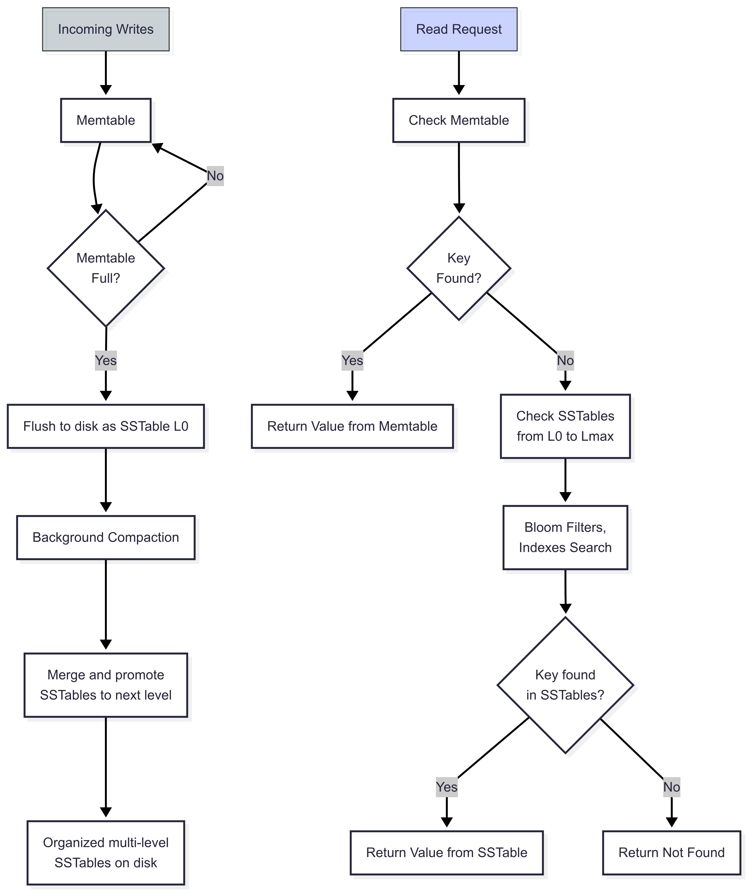

A **Log-Structured Merge Tree (LSM Tree)** is a data structure designed to efficiently handle **large volume of key-value data** in storage systems like SSDs or disks. It's optimized for **write-heavy workloads**, making it a popular choice in modern databases such as RocksDB, Elasticsearch, Cassandra and ScyllaDB, etc.

## Why Use LSM Trees ?

Traditional data structures like B-Trees update data in place, which results in **random disk I/O**, slow and inefficient on modern storage.

LSM Trees take a different approach, they **buffer writes in memory**, and **flush data to disk in sorted batches**, making them faster for inserts and updates. They also use clever background processes to keep read performance reasonable.

## How LSM Trees Work ?

The flowchart below illustrates how an LSM Tree processes writes and reads :

### 1. Write Path

- New data is first written to a memory buffer called the **memtable** (often implemented as a red-black tree or skip list)
- Once the memtable is full, it is flushed to disk as a **Sorted String Table (SSTable)**, a sorted, immutable file

This avoids random writes to disk and allowing **batching**, which greatly improves write throughput.

### 2. Disk Storage : SSTables and Levels

- SSTables are stored on disk in **multiple levels** (e.g., Level 0, Level 1, etc.), with each level larger and more organized than the previous one
- **Level 0** has recently flushed data, possibly with overlapping key ranges
- **Compaction** periodically merges SSTables across levels to :
  - Eliminate redundant or obsolete data
  - Maintain sorted order
  - Improve read performance

### 3. Read Path : Layered Search

When a key is queried :

1. **Check the memtable** (in-memory)
2. If not found, **Bloom filters** help quickly rule out SSTables that don't contain the key
3. Then, SSTables are searched **from newer to older**, starting from Level 0 and going deeper only if needed

Each SSTable uses **binary search and sparse indexes** to locate data quickly

:::note

**bloom filter**

A Bloom filter is a space-efficient probabilistic data structure that is used to test whether an item is a member of a set. (The bloom filter always say yes if an item is a set member. However, the bloom filter might still say yes although an item is not a member of the set, which is called a false positive.)

**sparse indexes**

Sparse indexes only contain entries for documents that have the indexed field, even if the index field contains a null value. This index skips over any document that is missing the indexed field.

:::

## Optimizations in LSM Trees

LSM Trees are packed with design choices that make them efficient :

| Optimization            | Description                                                               |
| ----------------------- | ------------------------------------------------------------------------- |
| **In-memory buffering** | Writes go to RAM first — faster than disk.                                |
| **Batched disk writes** | Memtables are flushed in large batches, reducing write amplification.     |
| **Append-only storage** | SSTables are immutable and written sequentially, ideal for SSDs.          |
| **Compaction**          | Cleans up, merges, and reorganizes data to keep reads and writes fast.    |
| **Bloom filters**       | Prevent unnecessary disk reads during lookups.                            |
| **Sparse indexes**      | Index only a subset of keys to reduce memory usage and speed up searches. |

### Tuning and Flexibility

LSM Trees can be **tuned for different workloads** :

- Faster reads : use more aggressive compaction and caching
- High write throughput : use larger memtables and delayed compation
- Massive datasets : scale by adding more levels and disk space

## B-Trees vs Log-Structured Merge-Tree (LSM Tree)

| Aspect         | **B-Trees**                      | **LSM Trees**                         |
| -------------- | -------------------------------- | ------------------------------------- |
| **Design**     | Balanced tree, in-place updates  | Multi-level, append-only write        |
| **Writes**     | Moderate, random I/O             | Fast, batched, sequential             |
| **Reads**      | Fast and consistent              | Slower, multi-level lookup            |
| **Memory Use** | Minimal buffering                | Writes buffered in memory (memtable)  |
| **Compaction** | Not needed                       | Required to merge and reorganize data |
| **Best For**   | Read-heavy or balanced workloads | Write-heavy workloads                 |
| **Examples**   | MySQL, SQLite                    | RocksDB, Cassandra                    |
