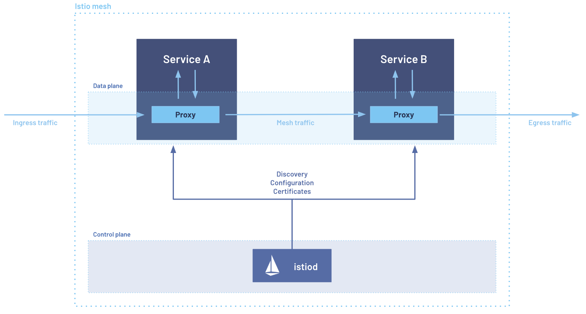

## Introduction

Istio helps manage **traffic routing**, **security** and **observability** between micorservices, acting as a control layer for communication.

Key benefits :
- **Secure traffic** : mutual TLS, authentication, and authorization
- **Smart routing** : e.g., load balancing, retries failover, and fault injection
- **Trafic policies** : e.g., rate limiting, quotas, and access control
- **Built-in observability** : metric logs, and distributed tracing
- No need to rewrite services : Istio works at the infrastructure level

## Istio’s Architecture and Operation

Istio uses **proxies** (typically Envoy) to intercept and manage traffic between services. These proxies are managed by a **control plane** that dynamically applies routing, security, and policy rules.

It supports two modes :

| Mode             | Description                                                                                         |
| ---------------- | --------------------------------------------------------------------------------------------------- |
| **Sidecar Mode** | Each pod has its own Envoy proxy to handle traffic.                                                 |
| **Ambient Mode** | Lightweight option that uses a per-node Layer 4 proxy and optional per-namespace Envoy for Layer 7. |

:::note

**eBPF’s Role in Istio**

Istio **does use eBPF**, for efficient traffic redirection, but not for complex tasks like deep traffic inspection or Layer 7 routing. That's because eBPF runs in the kernel and wasn't designed for high-level processing like what Envoy does in user space.

**CNI Plugins vs Istio**

While some CNI plugins offer basic service mesh capabilities, they are **platform-specific** and often lack the full features set and compliance of Istio's standard-based, cross-platform approach.

:::

:::important

**Why not just use one proxy per-node**

Running a shared proxy per node (for all services) creates **security risks**. If services from different tenants share the same proxy, it's hard to isolate them.

In **ambient mode**, Istio solves this by :
- Keeping node-level proxies (ztunnel) focused only on **Layer 4 traffic**
- Offloading complex Layer 7 logic to **per-namespace** proxies, avoiding multi-tenant risks

:::

### Architecture

Istio's architecture is divided into two main parts : the **data plane** and the **control plane**

- The **data plane** consists of lightweight **Envoy proxies** deployed as sidecars alongside application services. These proxies handle all incoming and outgoing traffic for each service, allowing Istio to manage, secure, and observe communication across the mesh.
- The **control plane** is responsible for configuring these proxies. It defines how traffic should be routed and ensures policies like security and traffic rules are consistently enforced.

#### Istiod 

Istiod is the central component of Istio's **control plane**. It manages service discovery, configuration distribution, and security features like certificate management.

Key responsibilities of Istiod include :
- Translating high-level traffic rules into Envoy-specific configurations
- Distributing configurations to Envoy sidecars at runtime
- Agggregating serviec discovery data from multiple platforms (e.g., Kubernetes, VMs)
- Managing mutual TLS (mTLS) identities and certificate rotation
- Enabling fine-grained traffic management, security policies, and access control

Acting as a Certificate Authority (CA), Istiod ensures that all communication in the service mesh can be encrypted and authenticated using mTLS.
