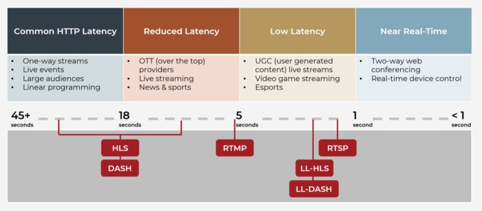

## Preface

Streaming media has become a cornerstone of how we consume content, from binge-watching shows on Netfilx to live gaming on Twitch or real-time security camera feeds. At the heart of this seamless experience are **streaming protocols**, the invisible engines that deliver video and audio across the internet.

## Introduce to Streaming Protocols

Streaming protocols are standardized methods that dictate how multimedia data (video and audio) is transmitted over the internet. They ensure that content is delivered efficiently, reliably, and with minimal delay, regardless of whether you're streaming a live event or watching an on-demand movie. Think of them as the rules and tools that devices use to send and receive media streams smoothly.

## Key Streaming Protocols and Their Features

### 1. RTSP (Real-Time Streaming Protocol)

**Purpose**

Controls the delivery of media streams, often used with RTP (Real-time Transport Protocol) for data transfer.

**Features**

- Supports multiple transport methods (UDP, TCP, or encrypted RTSPS)
- Highly flexible, works with codecs like H264, H265, VP8, VP9 and AV1
- Ideal for low-latency scenarios but requires specific client software (e.g., VLC, FFmpeg)

**Best for**

IP cameras, surveillance systems, and professional broadcasting.

### 2. RTMP (Real-Time Messaging Protocol)

**Purpose**

Originally developed by Adobe for Flash, now widely used for live streaming to platforms like YouTube and Twitch.

**Features**

- Reliable over TCP, iwth optional encryption (RTMPS)
- Supports H264 video and AAC/MP3 audio, but less flexible with newer codecs
- Low latency but less efficient than newer protocols like WebRTC

**Best for**

Live streaming to social media or content delivery networks (CDNs).

### 3. WebRTC (Web Real-Time Communication)

**Purpose**

Enables peer-to-peer, low-latency streaming directly in web browsers or apps.

**Features**

- Supports modern codecs (AV1, VP8, VP9, H264, H265, Opus)
- Uses UDP for speed, with extensions like WHIP (for publilshing) and WHEP (for playback)
- Works natively in browsers, no plugins needed

**Best for**

Video conferencing, live streaming apps, and interactive media.

### 4. HLS (HTTP Live Streaming)

**Purpose**

Splits streams into small chunks delivered over HTTP, widely used for on-demand and live streaming.

**Features**

- High compatibility with browsers and devices (especially Apple)
- Supprots low-latency (LL-HLS) and lagacy variants
- Scales well with CDNs for millions of viewers but has higher latency (0.5-15 seconds)

**Best for**

Video-on-demand platforms, mobile streaming, and large-scale broadcasts.

### 5. SRT (Secure Reliable Transport)

**Purpose**

A modern protocol for low-latency, secure streaming, often used with MPEG-TS.

**Features**

- Offers encryption and retransmission for reliable delivery
- Supports H264, H265, and various audio codecs
- Optimized for unstable networks (e.g., satellite or cellular)

### 6. UDP/MPEG-TS (MPEG Transport Stream over UDP)

**Purpose**

Sends media in MPEG-TS packets over UDP for fast, lightweight streaming.

**Features**

- Low latency but lacks error correction, making it sensitive to packet loss
- Supports unicast, multicast, or broadcast
- Common in tranditional broadcast environments

**Best for**

Local network streaming, IPTV, and multicast scenarios.

## Real-World Examples

1. **Live Sports Streaming** (e.g., ESPN, DAZN) : HLS

   HLS's compatibility with CDNs allows millions of fans to watch live sports on various devices with minimal buffering. Low-latency HLS reduces delays for near-real-time action.

2. **Video Conferencing** (e.g., Zoom, Microsoft Teams) : WebRTC

   WebRTC's peer-to-peer, low-latency design supports real-time video and audio, even on unstable networks. Its browser-native support eliminates the need for additional software.

3. **Live Streaming on Social Media** (e.g,. Twitch, YouTube) : RTMP (for publishing), HLS (for playback)

   Streamers use RTMP to push live content to platforms, which then use HLS to deliver it to viewers. RTMP’s reliability ensures stable uploads, while HLS’s scalability reaches global audiences.

4. **Security and Surveillance** (e.g, Ring, Arlo) : RTSP

   RTSP’s low-latency and codec flexibility make it ideal for IP cameras, allowing real-time monitoring with high-quality video (e.g., H265).

5. **Remote Brocast Production** (e.g., LiveU, TVU Networks) : SRT

   SRT’s encryption and retransmission ensure reliable streaming over unpredictable networks, like cellular or satellite, making it perfect for remote news or event production.
