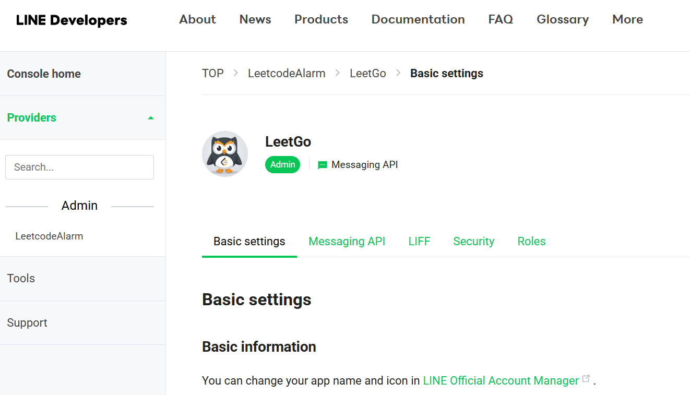

## Background

筆者最近也開始多鄰國，並且持續 100 多天了。近年來發現身邊越來越多人開始玩多這款學習型 APP。

玩下來的感想是，確實有學到東西。因此也覺得多鄰國的開發者很優秀，透過合理的費用方案提供給世界這麼優秀的軟體。

其中最特別的是它的 `streak` 功能，這個大概就是讓大家每天至少開啟 APP 一次的理由吧！

使用下來發現非常有效地提升我的學習沾黏度，因此我也突發奇想，若是這個機制可以套用到其他事情上讓我更自律呢？

因此這就是今天所介紹專案的由來 － LeetGo！

:::important

Github repository : [Leetcode Alarm](https://github.com/nu1lspaxe/leetcode-alarm)

:::

## Content

以下是關於這份專案的大致細節 :

1. 本質上就是一個 LineBot (筆者比較常用 Line)

2. 是 vibe coding 產物 (因為筆者不想在上面花太多時間，越短越好)

3. 有可能失效 (如果有在維護就是筆者有在用，而遇過的一次失效原因，是在一次 Leetcode 官網維修後，在執行 GraphQL 的請求需要加上 `X-CSRFToken` Header)

### LineBot

筆者也不打算針對 LineBot 架設作介紹，因為網路上有太多範本可以參考，而且你也可以透過各種 AI 找到可能的解答。

雖然筆者有點偷懶，但也是希望大家能培養自己搜查解決問題的能力！不過這個網站還是有我的聯繫方式，遇到任何問題歡迎詢問～

架設好你的 LineBot 之後，畫面可能會長類似這樣：

把以下欄位記下，之後會用到 :

- `Basic settings` 中的 `Your user ID`
- `Messaging API` 中的 `Channel access token`

### Workflow

那它的 workflow 基本上是透過 Github Action 去 trigger 的 (免費真香)，可以檢查專案內的 `.github/workflows` 資料夾，預設是每天 18:00 會執行。

但是畢竟是免費資源，Github 在執行這些 cronjob 時的排程不保證一定會在 18:00 執行，因此通常都會再過幾分鐘才會收到 LineBot 的警告通知。

### Secrets

可以透過 `fork` 取得這份專案，並且在專案下的 `Settings` > `Secrets and variables` > `Repository secrets` 設定以下項目 :

- `LEETCODE_USERNAME` : 你的 Leetcode username
- `LINE_USER_ID` : LineBot 中的 `Your user ID`
- `LINE_CHANNEL_ACCESS_TOKEN` : LineBot 中的 `Channel access token`

然後就大功告成囉！

你也可以手動 trigger Github Action 當作測試看看～
