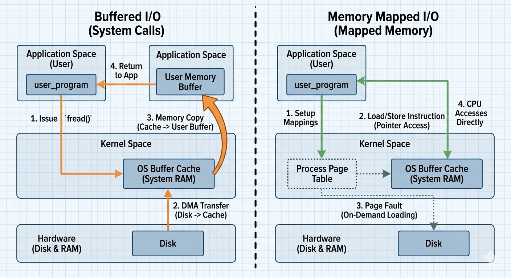

## Definition

[`mmap`](https://man7.org/linux/man-pages/man2/mmap.2.html) 的全名是 memory map。

它的機制是在虛擬記憶體中劃出一塊空間，對磁碟上的檔案區塊建立映射 (mapping)。

### `read()` vs `mmap()`

同樣是讀取檔案，使用 [`read()`](https://man7.org/linux/man-pages/man2/read.2.html) 的時候，會把資料從 kernel space 複製 (copy) 到 user space。

而 mmap 不會預先使用大量實體記憶體，而是透過類似 Lazy loading 的機制。在真正觸碰 (Read/Write) 數據時，因為尚未真的加載進記憶體而發生 Page Fault ，進而由核心執行 Demand Paging，將數據從磁碟搬到實體記憶體中 (Page-in)。

以下是透過 Gemini 生成的示意圖 :



## Which Is Best

乍看之下，似乎是 `mmap` 會比較快 ?

於是呢，筆者也爬文一番求證。根據[這篇 stackoverflow 的討論](https://stackoverflow.com/questions/45972/mmap-vs-reading-blocks)，其實兩者都各有其使用的最佳時機。

重點的使用情境如下 :

- `read(2)` : 順序讀取、用完即丟
- `mmap(2)` : **隨即存取**、長時間使用、與其他 process 共享資料 (請見 `MAP_SHARED`)

## Example

既然本文都是要介紹如何透過 `mmap` 加速，我們就透過這個**隨即存取**的範例，來比較 `read` 與 `mmap` 的效能：

在程式碼中有詳細的註解，說明每步驟在做什麼。

```rust
use memmap2::Mmap;
use std::fs::OpenOptions;
use std::io::{Read, Seek, SeekFrom};
use std::time::Instant;
use rand::RngExt;
use rand::rng;

const FILE_SIZE: usize = 512 * 1024 * 1024; // 測試檔案 512MB
const NUM_READS: usize = 1_000_000;         // 模擬 100 萬次隨機讀取
const READ_LEN: usize = 64;                 // 每次讀取 64 bytes

fn main() -> std::io::Result<()> {
    // 產生 100 萬個隨機的讀取位置 (Offsets)
    let mut mock_rng = rng();
    let read_offsets: Vec<usize> = (0..NUM_READS)
        .map(|_| mock_rng.random_range(0..FILE_SIZE - READ_LEN))
        .collect(); // 將結果收集進一個動態陣列 (Vector)

    // 建立一個 512MB 的空白測試檔案
    {
        let file = OpenOptions::new()
            .write(true)    // 寫入權限
            .create(true) // 如果檔案不存在則建立
            .truncate(true) // 如果檔案已存在則清空
            .open("read_test.dat")?;
        file.set_len(FILE_SIZE as u64)?;    // 預先分配檔案空間
    } // 作用域 (Scope) 的關係，創建 file 之後會自動關閉

    // --- Standard IO (Seek + Read) ---
    let mut file_std = OpenOptions::new().read(true).open("read_test.dat")?;
    let mut buffer = vec![0u8; READ_LEN];   // user space

    let start_std = Instant::now();
    for &offset in &read_offsets {
        // 每次移動指標都是一次 syscall (lseek)
        file_std.seek(SeekFrom::Start(offset as u64))?;
        // 每次讀取都需要將數據從 kernel copy 到 user buffer (read)
        file_std.read_exact(&mut buffer)?;
    }
    let duration_std = start_std.elapsed();

    // --- mmap (Memory Pointer Access) ---
    let file_mmap = OpenOptions::new().read(true).open("read_test.dat")?;

    // 這裡 unsafe 是因為記憶體映射直接操作虛擬位址，若檔案被外部截斷會導致崩潰
    let mmap = unsafe { Mmap::map(&file_mmap)? };

    let start_mmap = Instant::now();

    // 用來累加結果，確保編譯器不會優化而跳過讀取動作 (Dead Code Elimination)
    let mut sum: u64 = 0;

    for &offset in &read_offsets {
        // 直接透過指標偏移量讀取，類似存取陣列的概念
        // 這個操作發生在 user space，沒有 syscall 的開銷與數據拷貝
        let data = &mmap[offset..offset + READ_LEN];
        sum += data[0] as u64;
    }
    let duration_mmap = start_mmap.elapsed();

    println!("--------------------------------------");
    println!("Standard IO (Seek+Read) : {:?} ", duration_std);
    println!("mmap Random Access      : {:?} ", duration_mmap);
    println!("--------------------------------------");
    println!("性能提升: {:.2}x", duration_std.as_secs_f64() / duration_mmap.as_secs_f64());
    println!("(Checksum: {})", sum);

    Ok(())
}
```

那我們來看一下執行結果，以這個範例來說應該可以看到很明顯的差異 :

```text
--------------------------------------
Standard IO (Seek+Read) : 4.0149515s
mmap Random Access      : 208.6843ms
--------------------------------------
性能提升: 19.24x
(Checksum: 0)
```

大致上是這樣！今天的你又前進了一步，給自己一點鼓勵！
